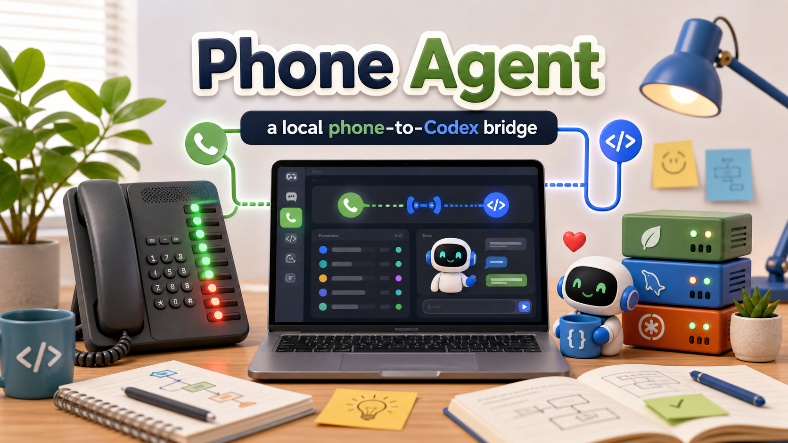
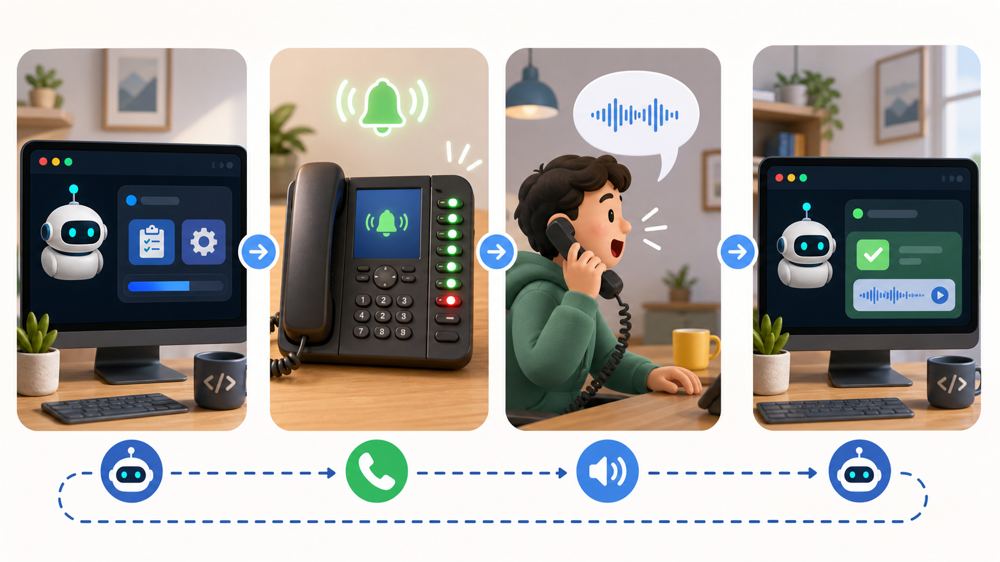
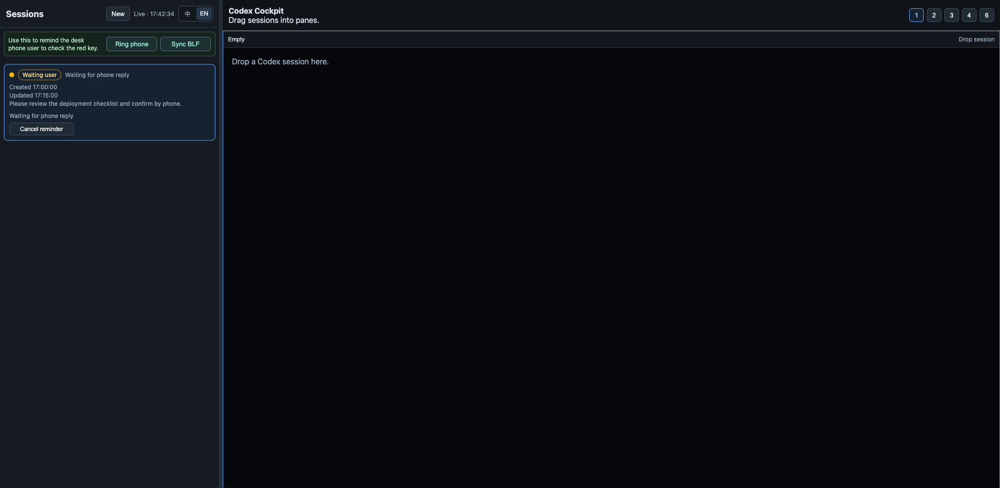
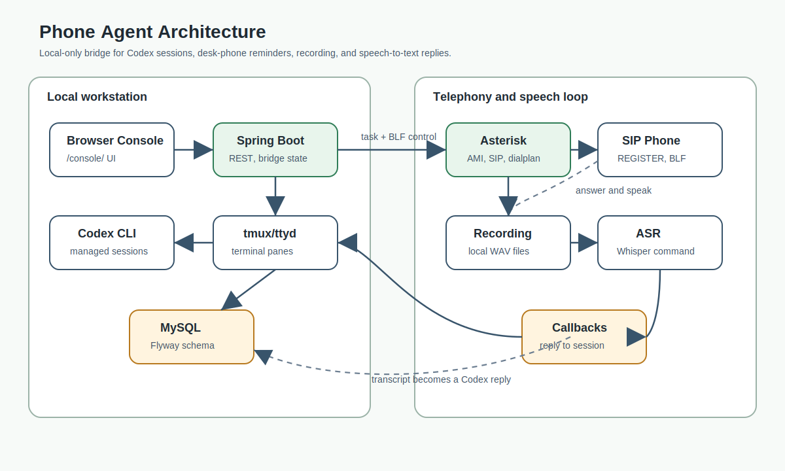
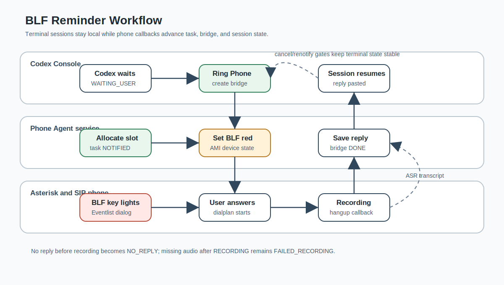

# Phone Agent

English | [中文](README.zh-CN.md)



Phone Agent is a local phone-to-Codex bridge. It connects a desk-phone workflow, Asterisk tasks, local speech recognition, and managed Codex terminal sessions so a user can start or continue Codex work from a phone call.

This project is a local development and lab tool, not a hosted multi-tenant service. The Console exposes writable terminal access to managed Codex sessions, so run it on loopback by default and do not expose it to the public internet without adding authentication, CSRF protection, firewall rules, and proper secret management.





## Supported Scenario

Phone Agent supports a local Spring/MySQL service, the Codex Console, local Asterisk, and a SIP phone or softphone on a network you control. It is not a hosted SaaS product, does not provide public internet hardening, and does not include phone-brand UI tutorials.

The open-source main path is the full phone workflow: Spring, MySQL, Asterisk, AMI, SIP registration, Eventlist BLF/dialog subscriptions, ringing, recording, and ASR callback checks. Software-only checks are developer/testing aids for Console/API smoke and CI; they do not prove the full Phone Agent workflow.

## Supported Phone Setup

The validated example device is a Grandstream GXP1630, but it is not the only supported device. A phone or softphone can be used when it supports SIP REGISTER and Eventlist BLF/dialog subscription. The full BLF red-light experience requires both configured SIP registration and Eventlist BLF/dialog subscription; a basic SIP registration alone can ring but does not prove BLF watchers.

Phone Agent documents the fields to synchronize instead of each vendor's UI path: SIP server, SIP user, SIP auth ID, SIP password, Eventlist BLF URI, and BLF key values. These values come from `.env.local` and the generated Asterisk configuration.

## Capabilities

- Spring Boot service with MySQL/Flyway persistence.
- Codex Console for creating, viewing, dragging, and arranging managed Codex sessions.
- Phone bridge that can remind a registered desk phone when Codex waits for user input.
- ASR callback flow that writes phone replies back into the matching Codex session.
- Global Ring Phone control for desk-phone reminders.
- Chinese and English Console UI text.
- Chinese and English prompt templates for initial inbound requests and phone replies.

## Requirements

Required for the core local workflow:

- JDK 25 or the project toolchain equivalent.
- A user-prepared MySQL service and database reachable by Spring Boot.
- Codex CLI.
- `tmux`.
- `ttyd`.
- `curl` and `nc` for local checks.

Required for the phone and speech workflow:

- Docker with the Compose plugin.
- Asterisk, commonly started through `ops/asterisk-mvp/docker-compose.yml` with the `mlan/asterisk:latest` image.
- AMI credentials for Asterisk.
- `ffmpeg`.
- Whisper-compatible ASR command and model.
- macOS `say` or another configured TTS command.
- A registered phone device, such as a Grandstream GXP1630, for hardware end-to-end checks.

Software-only checks can run without real phone hardware for development smoke tests, but phone registration, ringing, recording, and full ASR callback validation need the local telephony environment.

## Install

1. Clone the repository.

```bash
git clone <repo-url>
cd phone-agent
```

2. Install JDK 25 and make it available through `JAVA_HOME` or `PATH`.

3. Install the core local tools: `curl`, `nc`, and the tools needed by the full phone workflow.

4. Prepare MySQL yourself. Create the MySQL service and the `PHONE_AGENT_MYSQL_DATABASE` database before startup; the dev script reads connection settings and does not create or manage a MySQL container, service, or database.

## Configure

Copy the configuration sample to a local, untracked file:

```bash
cp .env.example .env.local
```

Edit `.env.local` for your machine. Command values can be command names on `PATH` or absolute executable paths. Real secrets and local machine paths should stay in `.env.local`.

Export values before running the dev script:

```bash
set -a
source .env.local
set +a
```

The most important variables are:

- `PHONE_AGENT_MYSQL_*` for MySQL.
- `PHONE_AGENT_AMI_*` for Asterisk AMI.
- `PHONE_AGENT_SIP_EXTENSION`, `PHONE_AGENT_SIP_AUTH_ID`, `PHONE_AGENT_SIP_PASSWORD`, `PHONE_AGENT_RING_TARGET`, `PHONE_AGENT_BLF_EVENTLIST_URI`, and `PHONE_AGENT_BLF_EXTENSIONS` for the phone account, ring target, Eventlist BLF URI, and slot-to-BLF mapping.
- `PHONE_AGENT_ASTERISK_EXTERNAL_SIGNALING_ADDRESS` and `PHONE_AGENT_ASTERISK_EXTERNAL_MEDIA_ADDRESS` for generated Asterisk transport addresses.
- `PHONE_AGENT_FFMPEG_COMMAND`, `PHONE_AGENT_WHISPER_COMMAND`, and `PHONE_AGENT_WHISPER_MODEL_PATH` for ASR.
- `PHONE_AGENT_CODEX_COMMAND`, `PHONE_AGENT_TMUX_COMMAND`, and `PHONE_AGENT_TTYD_COMMAND` for managed Codex terminals.
- `PHONE_AGENT_SPRING_BIND_ADDRESS`, which defaults to loopback in Spring but may be set to `0.0.0.0` by the dev script so Asterisk Docker callbacks can reach Spring.

MySQL is configured through:

```bash
PHONE_AGENT_MYSQL_HOST=127.0.0.1
PHONE_AGENT_MYSQL_PORT=3306
PHONE_AGENT_MYSQL_DATABASE=phone_agent
PHONE_AGENT_MYSQL_USER=phone_agent
PHONE_AGENT_MYSQL_PASSWORD=change-me
```

Spring Boot runs Flyway schema migrations during startup. The script checks the MySQL TCP endpoint only; database, authentication, and Flyway readiness are verified by Spring startup health and logs. The script does not run `CREATE DATABASE`.

## Quick Start

Use this path for the open-source full phone workflow.

1. Start Spring and Asterisk from the repository root.

```bash
scripts/phone-agent-dev.sh start
```

`start` performs the full phone preflight, refreshes generated Asterisk configuration when needed, starts Asterisk and Spring, waits for Spring health, and reports warning-level phone/BLF post-checks.

2. Check the complete local chain.

```bash
scripts/phone-agent-dev.sh status
```

`status` is read-only and is the first diagnostic command for Java, Spring, MySQL TCP reachability, phone configuration, Asterisk, Asterisk config, callback reachability, AMI permissions, SIP registration, Eventlist BLF subscription, and BLF watchers. Database, authentication, and Flyway readiness are verified by Spring startup health and logs.

3. Open the Console.

```text
http://127.0.0.1:8080/console/
```

4. Read logs when needed.

```bash
scripts/phone-agent-dev.sh logs spring
scripts/phone-agent-dev.sh logs asterisk
scripts/phone-agent-dev.sh logs all -f
```

5. Stop the script-managed runtime.

```bash
scripts/phone-agent-dev.sh stop
```

`stop` stops the script-managed Spring process and Asterisk Compose service only. It does not stop, delete, create, or clean up your MySQL service or database.

## Architecture



## BLF Workflow



## Developer Notes and Testing

Software-only mode is useful for Console/API smoke, documentation contracts, prompt formatter checks, and CI where Asterisk or a phone is unavailable. It is not a full Phone Agent proof because it skips Asterisk, SIP registration, Eventlist BLF subscriptions, BLF watchers, real ringing, recording, and ASR callback behavior.

Run automated tests with:

```bash
./gradlew test jacocoTestReport
node --test src/test/js/*.test.mjs
```

Maintainers may still use legacy/development script flags such as software-only mode for focused smoke tests. Keep those flags out of user-facing quick start steps.

## Phone and Asterisk Hardware Setup

The quick start starts Asterisk for the full workflow. Use this section to understand and verify the phone side.

1. Start Asterisk through the checked-in Compose file:

```bash
cd ops/asterisk-mvp
docker compose up -d
```

The Compose service uses `mlan/asterisk:latest`, exposes SIP/RTP ports, binds AMI to `127.0.0.1:5038`, mounts `ops/asterisk-mvp` as Asterisk config, and mounts `runtime/sounds` and `runtime/recordings` for generated audio and recordings. If the image cannot be pulled in your environment, replace the image in `ops/asterisk-mvp/docker-compose.yml` with an equivalent Asterisk image and verify `manager.conf`, `pjsip.conf`, `extensions.conf`, AMI, SIP, and recording paths still work.

2. Configure the desk phone. The validated GXP1630 setup uses:

- SIP server: the host IP reachable by the phone, for example `192.168.10.1`.
- SIP user / auth ID / password: `1001` / `1001` / `1001`.
- Eventlist BLF URI: `phone-agent-slots`.
- BLF values: `601` through `608`.

For customized values, update `.env.local`, export it, then run `scripts/phone-agent-dev.sh start` from the repository root. `start` refreshes generated Asterisk configuration before starting Asterisk. Changing SIP or BLF values does not run a database migration, does not hot-remap active tasks at runtime, and may require manual cleanup or rebuild of conflicting historical local development data.

3. Start the full phone workflow from the repository root:

```bash
scripts/phone-agent-dev.sh start
```

Run the full read-only check at any point with:

```bash
scripts/phone-agent-dev.sh status
```

4. Confirm Asterisk can reach Spring:

```bash
docker exec phone-agent-asterisk-mvp \
  sh -lc 'curl -fsS --max-time 2 http://host.docker.internal:8080/actuator/health'
```

5. Confirm phone registration and BLF subscriptions:

```bash
docker exec phone-agent-asterisk-mvp asterisk -rx 'pjsip show contacts'
docker exec phone-agent-asterisk-mvp asterisk -rx 'pjsip show subscriptions inbound'
docker exec phone-agent-asterisk-mvp asterisk -rx 'core show hints'
```

Detailed topology, ports, SIP settings, smoke tests, and recovery commands are in [Local Deployment](docs/DEPLOYMENT.md).

## Basic Workflow

1. Open `http://127.0.0.1:8080/console/`.
2. Create or open a managed Codex session.
3. Work in the embedded terminal until Codex asks for more user input.
4. When Codex is waiting, use the phone bridge or the global Ring Phone control to notify the desk phone user.
5. The phone user answers, speaks a reply, and ends the recording.
6. ASR converts the recording and Phone Agent writes the phone reply back into the same Codex session.

## Browser Cockpit

The Console is the browser cockpit for local operation:

- Left side: session list, status, bridge state, and phone actions.
- Right side: managed terminal panes with fixed `1/2/3/4/6` layouts.
- Language control: Chinese and English UI chrome.
- Responsive layout: desktop cockpit and mobile 390px/430px views are covered by rendered evidence.

The UI chrome is localized. Session titles, historical task text, terminal output, and user-generated content are shown in their original language.

## Configuration

The Spring defaults live in `src/main/resources/application.properties`. Local overrides should come from environment variables, Spring command-line properties, or an untracked local file.

Important defaults:

- `server.address=127.0.0.1` keeps the app bound to loopback by default.
- `phone-agent.codex.prompt-language=zh-CN` selects Chinese prompt templates for server-generated Codex prompts.
- `phone-agent.codex.allowed-workspace-roots[0]=${user.dir}` restricts managed sessions to the current project by default.

The dev script may bind Spring to `0.0.0.0` for local Docker/Asterisk callbacks. That does not make the Console safe for remote users; the Console/API safety boundary still depends on loopback checks and local-network assumptions.

The variables in `.env.example` use the `PHONE_AGENT_*` names read by `scripts/phone-agent-dev.sh`. The script passes the relevant MySQL, AMI, ASR, Codex, and prompt-language values through to Spring Boot when starting the app.

The script reads `PHONE_AGENT_MYSQL_HOST`, `PHONE_AGENT_MYSQL_PORT`, `PHONE_AGENT_MYSQL_DATABASE`, `PHONE_AGENT_MYSQL_USER`, and `PHONE_AGENT_MYSQL_PASSWORD`. MySQL service and database lifecycle stays with the user; Flyway applies schema migrations when Spring starts.

## Software-only Checks

Without a registered desk phone, you can still validate:

- Java tests and JS Console tests.
- Console loading, session list rendering, language switching, and responsive layout.
- Documentation and configuration structure.
- Prompt formatter behavior.

Full ringing, recording, ASR callback, and physical BLF workflows require a local Asterisk and phone device.

## Documentation

- [Architecture](docs/ARCHITECTURE.md) | [中文](docs/ARCHITECTURE.zh-CN.md)
- [Security](docs/SECURITY.md) | [中文](docs/SECURITY.zh-CN.md)
- [Troubleshooting](docs/TROUBLESHOOTING.md) | [中文](docs/TROUBLESHOOTING.zh-CN.md)
- [Local Deployment](docs/DEPLOYMENT.md) | [中文](docs/DEPLOYMENT.zh-CN.md)
- [Contributing](CONTRIBUTING.md) | [中文](CONTRIBUTING.zh-CN.md)

## Known Limits

- No hosted SaaS, multi-user, or multi-tenant isolation is provided.
- No production remote-access authentication design is included.
- Real phone hardware validation depends on the user's local Asterisk, network, and device state.

## License

Phone Agent is licensed under the [MIT License](LICENSE).
